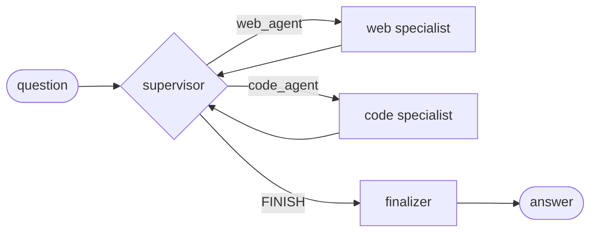

# Elmdin Agent

[](https://github.com/Elmdin/agent/actions/workflows/ci.yml)
[](https://github.com/Elmdin/agent/actions/workflows/codeql.yml)
[](https://github.com/Elmdin/agent/actions/workflows/security.yml)
[](LICENSE)
[](https://www.python.org)
[](https://github.com/astral-sh/ruff)

A supervisor multi-agent system for autonomous research, reasoning and code
execution, built on LangGraph. A supervisor routes each turn to a specialist —
web research or sandboxed code — and a finalizer produces an exact-match answer.

Near-term target: **GAIA Level 1**. Architecture target: **Level 3**.
See the [roadmap](docs/roadmap.md).

## Quick start

```bash
pip install -e ".[dev,tools,app]"
cp .env.example .env          # add at least one provider key
agent doctor                  # what is configured, what is degraded
agent run --limit 3           # answer three benchmark tasks
agent submit --username <hf-user>
```

Or run the UI: `python app.py`.

## How it works



Four design commitments, each learned from a production failure:

1. **Nothing runs at import time.** No client, credential read, or network call
   on import — a missing optional key degrades one tool instead of killing the
   process. ([ADR 0003](docs/adr/0003-lazy-tool-initialisation.md))
2. **Everything is bounded.** Every loop has an iteration cap, every request a
   timeout, every run a wall-clock budget.
   ([ADR 0002](docs/adr/0002-budgets-over-retries.md))
3. **Work is never lost.** Answers cache to disk as they are produced;
   submission is a separate action.
4. **Immutable by default.** Configuration and metrics are frozen dataclasses.

## Configuration

At least one model provider is required; everything else degrades gracefully.

| Secret | Required | Without it |
|---|---|---|
| `GROQ_API_KEY` / `OPENAI_API_KEY` / `HF_TOKEN` | **yes** (one) | fails at the first model call |
| `TAVILY_API_KEY` | no | `web_search` returns "unavailable"; scraping still works |
| `E2B_API_KEY` | no | `python_repl` returns "unavailable"; the agent reasons instead |
| `LANGSMITH_API_KEY` | no | no traces; logs and metrics unaffected |

Full table, including every budget: [docs/configuration.md](docs/configuration.md).

## Observability

- **Logs** — stdout and `logs/agent.log`
- **Traces** — LangSmith, one trace per task named `task:<task_id>`
- **Metrics** — `logs/metrics.jsonl`: latency, tokens, status per task

See [docs/observability.md](docs/observability.md).

## Development

```bash
pytest -m unit                 # 122 tests, offline, no credentials
ruff check . && ruff format .
mypy                           # strict
pytest -m integration          # needs live credentials
```

CI runs lint, strict types, tests on Python 3.11–3.13 across Linux/macOS/Windows,
a build, and an import check against the exact dependency set the Hugging Face
Space installs. See [CONTRIBUTING.md](CONTRIBUTING.md).

## Documentation

| | |
|---|---|
| [Architecture](docs/architecture.md) | Supervisor, specialists, budgets |
| [Configuration](docs/configuration.md) | Every environment variable |
| [Observability](docs/observability.md) | Logs, traces, metrics |
| [GAIA benchmark](docs/gaia.md) | Running and scoring |
| [Roadmap](docs/roadmap.md) | Level 1 → Level 3 |
| [ADRs](docs/adr/index.md) | Why it is built this way |
| [Security](SECURITY.md) | Threat model and reporting |

## License

[Apache License 2.0](LICENSE). See [NOTICE](NOTICE) for attribution.
